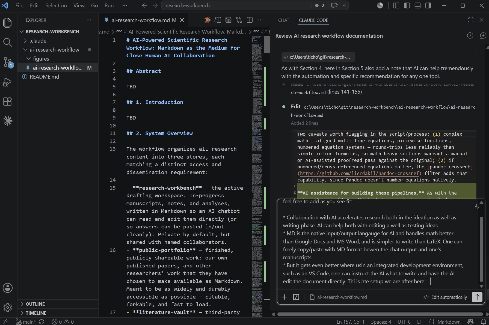
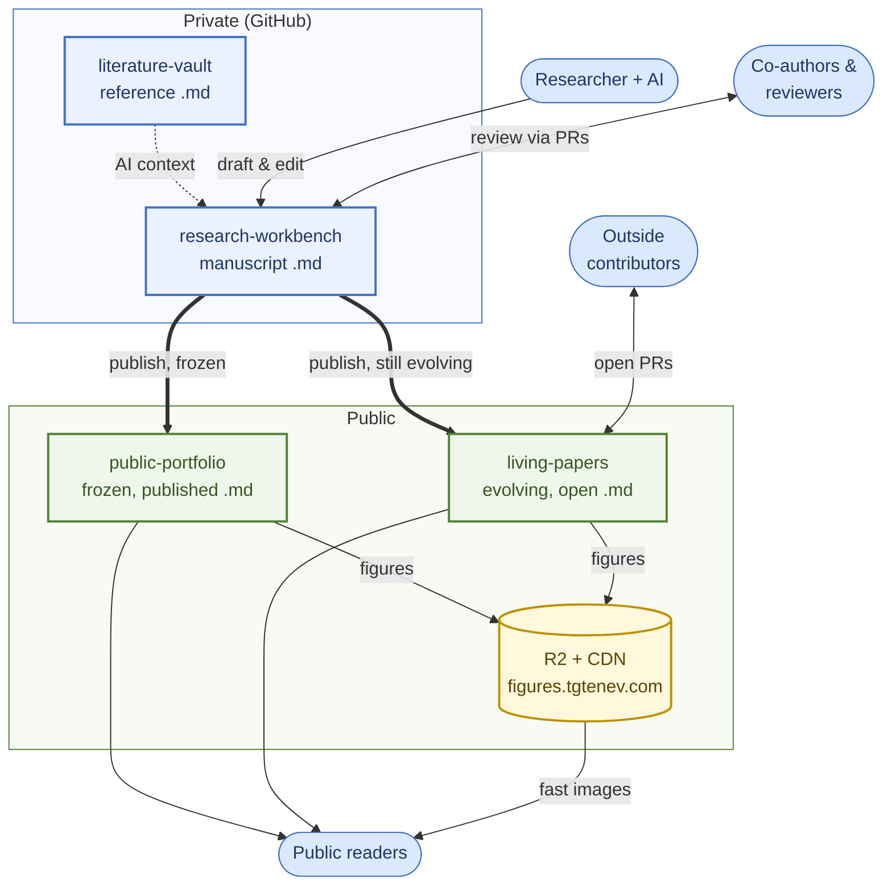

# AI-Powered Scientific Research Workflow: Markdown as the Medium for Close Human-AI Collaboration

**Document Metadata**

| | |
|---|---|
| **Store** | living-papers |
| **Version** | v4 |
| **Last updated** | 2026-07-17 |
| **Branch** | `main` |
| **Revision note** | Publication-prep pass against a second week of observed practice. §5.1 gains the committed scratch document as a middle context form; §5.5 gains digest figures/PDF export, the self-referential pointer to this paper's own review register, and program-wide maintenance sweeps (rename ripples, document retirement); Limitations now states plainly that the multi-author loop is designed but not yet exercised (solo + AI practice so far) and drops a dangling reference to a figure-naming convention no longer described. Fixed the §4 step ordering, a §5.8 cross-reference, and supplied the verified URL for reference [5]. Noted in §5.5 that a worked program example is forthcoming, and added this paper's own `context.md` alongside it. |

---

## Abstract

Scientific writing now proceeds through two collaboration loops — among human co-authors and reviewers, and between a researcher and an AI collaborator — that have so far required separate, incompatible tools: collaboration platforms keep content in formats an AI cannot read or edit at rest, while AI-native editors offer no multi-author review or access control. This paper argues that both loops can be served by a single medium, Markdown kept under version control, because a Markdown file is simultaneously the plain text an AI reads and writes with no conversion step and the diffable artifact co-authors review as pull requests. Realizing this requires more than a file format: a single researcher's Markdown accumulates several kinds of content with different audiences, and conflating them exposes restricted material or burdens private drafts with public infrastructure they don't need. We resolve this by organizing content into four GitHub-repository stores differentiated by access and dissemination requirement — a private drafting workspace shared with named collaborators, a restricted vault of third-party reference material, a frozen public portfolio of finished work, and a public store of evolving documents open to outside pull requests — and describe the setup, canonical workflows, and citation and governance practices each requires. The result is a workflow in which drafting, multi-author review, AI-assisted revision, and public dissemination share one substrate rather than four disconnected tools, demonstrated throughout on this paper's own drafting and publication history.

## 1. Introduction

Scientific writing has long depended on collaboration tooling built for people. Co-authors and reviewers exchange revisions, leave comments, and reconcile competing edits, and a range of systems — journal editorial platforms, Overleaf, Google Docs — exist to make that human-to-human loop work. Capable AI has since introduced a second, quite different loop. A researcher now drafts alongside an AI collaborator that can stress an idea before it is written down and then draft or revise prose directly — increasingly not in a separate chat window but inside the editor itself, reading the open file, seeing the diff, and editing in place. This researcher–AI–IDE loop [1, 2] has rapidly become a mode of working in its own right.

These two loops have so far lived in separate tools, each optimized for one at the expense of the other. Collaboration platforms keep content in formats an AI cannot read or edit at rest — proprietary blocks, or LaTeX that chatbots handle awkwardly — while AI-native editors provide the tight drafting loop but offer no multi-author review, access control, or shared context. Bridging them means copying text across an export/import boundary, which breaks the immediacy that makes each loop valuable. **The problem this paper addresses is how to make both loops part of a single, organic experience: one in which the same document is at once the artifact co-authors review and the artifact the AI reads and writes.**

The answer developed here turns on one choice of medium — Markdown kept under version control. Markdown is the native input/output format for AI chatbots: plain text in, plain text out, with no proprietary format to parse or re-serialize. It represents mathematical notation more naturally than word processors such as Google Docs or Microsoft Word, where equations are opaque embedded objects, while remaining simpler to read and write than raw LaTeX. Because chatbot output is already Markdown by default, text moves between a chat window and a manuscript in either direction with no reformatting step — and because a Markdown file is plain text under git, it is simultaneously what co-authors review as diffs and pull requests. The same file serves both loops.

This convergence is sharpest once the AI operates inside an integrated development environment such as VS Code rather than a separate chat window: it can then edit the manuscript directly in place, with the file open, the diff visible, and the full document as context, rather than the human relaying pasted text by hand (Figure 1). This directness carries an ordinary git caveat: because both the human and the AI can write to the same file, a session should start from a clean, committed state and commit before another session begins, so one writer's edits are never silently overwritten by another's — the usual discipline for any file two collaborators might touch concurrently, not a limitation specific to AI collaboration.



**Figure 1.** VS Code with the Claude Code panel open next to this paper's own `ai-research-workflow.md`. The chat instructs the AI to add content to a specific section, and the AI edits the open file directly — rather than the human copying generated text in from a separate chat window — which is the close human-AI collaboration loop this paper describes.

**Related work.** Drafting scholarly text with an AI collaborator has begun to be studied and tooled from several directions. On the formal side, Chen et al. [3] introduce XtraGPT, a family of open models trained for instruction-guided, section-level revision of academic papers while preserving authorial control, and Park [4] proposes a transparency protocol for AI-assisted writing in which authors record their research perspective and section-specific intent rather than raw prompts. Less formally, the "vibe research" practice [1] captures the same rapid human-AI drafting loop assumed here, though as an ad hoc habit rather than a reproducible system. A parallel line of work targets the editing surface itself: tools such as claude-review [2] and the OpenKnowledge editor [5] wire an AI agent directly into local Markdown files with git-backed versioning, while typesetting systems such as Quarkdown [6] position Markdown as a middle ground between plain prose and LaTeX — echoing a broader convergence on Markdown as the native format for agentic AI [7]. What distinguishes the present work is not the editing loop, which these efforts already demonstrate, but the separation of research content into four stores differentiated by access and dissemination requirements (§2): prior tools largely treat all documents uniformly, leaving the private-draft, frozen-public-output, evolving-public-output, and restricted-reference distinctions to the user.

The remainder of the paper develops those four stores: their rationale (§2), the elements and setup they require (§3–§4), and the workflows they support (§5), before §6–§7 return to how the design resolves the problem posed above.

## 2. System Overview

Delivering the single experience described above begins with an observation about the content itself. A single researcher accumulates several kinds of Markdown content with different audiences: private drafts, other people's papers and datasets kept only for reference, finished work meant for the world, and public work still evolving in the open. Conflating them creates risk — restricted material can be exposed, or private drafts burdened with public-facing infrastructure they don't need. The workflow addresses this by organizing all research content into four stores, each matching a distinct access and dissemination requirement:

- **research-workbench** — the active drafting workspace. In-progress manuscripts, notes, and analyses, written in Markdown so an AI chatbot can read and edit them directly (or so answers can be pasted in/out cleanly). Private by default, but shared with named collaborators.
- **public-portfolio** — finished, publicly shareable work: our own published papers, and other researchers' work that they have chosen to make available as Markdown. Meant to be as widely and durably accessible as possible — citable, forkable, and fast to load. Once a paper lands here, it is frozen: a fixed version of record, matching whatever venue or DOI it cites.
- **literature-vault** — third-party published material converted to Markdown so it can serve as AI-readable reference context while drafting (e.g. "write this section consistent with the findings in these five papers") — and not only prose: published **datasets** are acquired here too, their data tables converted to Markdown (or a small in-repo data file) so the AI can fit or check the work against real numbers rather than treat the source as background alone. Not for redistribution: the conversion is for internal use only, and the underlying material typically cannot be shared publicly for copyright reasons.
- **living-papers** — public work that stays open to revision and outside contribution, in the manner of an open-source project, without ever being declared a frozen version of record tied to a journal or DOI. Suited to fast-moving fields where a document is more useful kept current than sealed at a publication date. Public, with pull requests and issues open to outside contributors, not just named collaborators.

The four stores reflect genuinely different requirements, not an arbitrary taxonomy: research-workbench needs fine-grained collaborator access and strong version control for iterative editing; public-portfolio needs to be fast and durable with no access control, but also fixed, since a citation should resolve to stable content; literature-vault needs to stay restricted to the researcher and immediate collaborators indefinitely, with no dissemination path; living-papers needs public-portfolio's open reach without public-portfolio's finality, and research-workbench's openness to pull-request revision without research-workbench's restricted access. That combination — public *and* still evolving — is what makes it a distinct store rather than a variant of the other two. Keeping the four separate means each carries only the infrastructure it needs.



**Figure 2.** The four-store architecture, grouped by access. Within the private repositories, the researcher and AI draft in **research-workbench** — reviewed by co-authors through pull requests — while pulling reference context from **literature-vault**. A manuscript is published either to **public-portfolio**, frozen as a version of record, or to **living-papers**, which stays open to outside contributors through ordinary pull requests. Figures in both public stores are optionally served from an object-storage bucket behind a CDN (e.g. `figures.tgtenev.com`) — referenced by URL rather than committed — for fast delivery to public readers.

Each store is a GitHub repository holding the Markdown text (private for research-workbench and literature-vault, public for public-portfolio and living-papers). Figures for the two private stores live alongside their Markdown in-repo. For the two public stores, figures are optionally (§3) served from a public object-storage bucket behind a CDN — referenced from the Markdown by URL rather than committed to the repo — which speeds up loading image-heavy public papers for a broad audience; where that setup is not worth it, a small figure set can still live in-repo, as this paper's own single figure does.

**Worked example: this paper itself.** This document was drafted in the `research-workbench` GitHub repository at `github.com/tgtenev/research-workbench`, path `ai-research-workflow/ai-research-workflow.md`, branch `main` — private, consistent with its own taxonomy — and, being itself a document about an evolving field, was subsequently published to the public `living-papers` repository rather than frozen into public-portfolio. That move illustrates both the raw/rendered distinction from §3 and the private/public distinction above:

- **Human, rendered view (works at either stage)** — `https://github.com/tgtenev/research-workbench/blob/main/ai-research-workflow/ai-research-workflow.md` while drafting, then `https://github.com/tgtenev/living-papers/blob/main/ai-research-workflow/ai-research-workflow.md` once published. GitHub's blob viewer renders headings, tables, LaTeX math, and the Mermaid diagram (Figure 2) for anyone with repo access, with no extra tooling — though GitHub's math renderer is stricter than a local preview, and authoring math so it renders there takes some care (§5.8).
- **AI, raw-text view of a private draft (needs authentication)** — while the document lived only in research-workbench, the plain-text URL `https://raw.githubusercontent.com/tgtenev/research-workbench/main/ai-research-workflow/ai-research-workflow.md` returned a 404 to an anonymous request, because research-workbench is private. Fetching it required a credential scoped to the repo, e.g. `curl -H "Authorization: token $GITHUB_TOKEN" https://raw.githubusercontent.com/tgtenev/research-workbench/main/ai-research-workflow/ai-research-workflow.md`, or `gh api repos/tgtenev/research-workbench/contents/ai-research-workflow/ai-research-workflow.md --jq '.content' | base64 -d`. This applies generally to research-workbench and literature-vault: an AI chatbot needs an authenticated request, not just the bare URL.
- **AI, raw-text view once published (no auth needed)** — once the paper moved to living-papers (`github.com/tgtenev/living-papers`), the equivalent raw URL, `https://raw.githubusercontent.com/tgtenev/living-papers/main/ai-research-workflow/ai-research-workflow.md`, became fetchable by anyone, with no credentials — and, unlike a public-portfolio URL, keeps changing as outside contributors and the author continue to revise it. This is the version to use as the "paste this URL" example in day-to-day use; the authenticated case applies only while a document remains a private draft.

## 3. Required and Optional Elements

**Required:**

- **An AI subscription** (e.g. Claude) — the working partner for drafting, editing, and querying Markdown content. Because manuscripts and literature-vault references are plain Markdown text, the AI can read and edit them directly with no conversion step.
- **VS Code** (or another Markdown-capable editor) — for local editing and side-by-side rendered preview.
- **A GitHub account** — hosts the repositories for all four stores, provides version control, and (for research-workbench, and for living-papers' outside contributors) collaborator access and pull-request-based review.

**Optional:**

- **An S3-compatible object storage account**, e.g. Cloudflare R2 — used only for public-portfolio and living-papers figures, where CDN-backed delivery meaningfully speeds up loading image-heavy public papers for a broad audience. Not needed for research-workbench or literature-vault, whose figures can simply live in their private repos.
- **A custom domain** pointed at the storage bucket, e.g. `figures.tgtenev.com` — gives public figure links a stable, branded, memorable URL instead of the storage provider's default bucket domain.

Conversion tooling (Docling, Pandoc) is not listed here: it is needed only once literature-vault or public-portfolio conversion pipelines are in use, not as part of core setup. See §5 for the specific tools and when to install them.

**Why Markdown serves both machine and human consumption.** A `.md` file is plain text, so an AI chatbot reads or edits it directly with no parsing step, and it diffs cleanly in git. The same file also renders as formatted prose — headings, tables, LaTeX math, images — via VS Code's Markdown preview, GitHub's web UI, or any static site generator, though these renderers do not agree on every edge case and math in particular needs authoring for GitHub's stricter engine (§5.8). No second copy exists for the human-readable view; the raw text and the rendered view are the same file, which keeps the AI's edits and the human's reading experience in sync.

## 4. Setup Guide

1. **Sign up for Claude.** Create an account at claude.ai (or set up Claude Code / the Claude API) and choose a subscription tier that supports the expected volume of drafting and reference-reading work.
2. **Install VS Code.** Download from code.visualstudio.com; install a Markdown preview/editing extension (VS Code's built-in Markdown preview covers the basics — headings, tables, and images render out of the box).
3. **Create a GitHub account.** Sign up at github.com. Create:
   - a private repository for research-workbench (add collaborators as needed, via repo Settings → Collaborators),
   - a public repository for public-portfolio,
   - a private repository for literature-vault (collaborators limited to whoever is actively drafting with that reference material),
   - a public repository for living-papers, left open to outside pull requests and issues rather than restricted to named collaborators — with branch protection requiring review before merge (so outside contributors get pull-request access, never direct write), an explicit license (e.g. CC-BY-4.0) covering contributed text, and a short `CONTRIBUTING.md` note on how citations and authorship for outside contributions are handled.
4. **Clone the repositories locally.** `git clone` each repo (research-workbench, public-portfolio, literature-vault, living-papers) to your machine so VS Code can open and edit them directly, with the AI editing in place as shown in Figure 1.
5. **(Optional) Set up Cloudflare R2.** Create a Cloudflare account, create an R2 bucket for public-portfolio and living-papers figures, and generate an API token scoped to that bucket for uploads.
6. **(Optional) Point a custom domain at the bucket.** In Cloudflare DNS, add the domain (e.g. `figures.tgtenev.com`) and enable the bucket's public custom-domain feature so figure URLs resolve through it instead of the default R2 bucket URL.

Any credential generated in this section — the GitHub token used for authenticated raw-URL fetches in §2, the R2 API token in step 5 — should be kept out of the repositories entirely: exported as a local environment variable or stored as a GitHub Actions secret, never committed to a tracked file, even in a private repo.

**Getting more detailed instructions from an AI chatbot.** The steps above are deliberately high-level: each one (creating a Cloudflare API token, configuring a custom domain, setting repo collaborator permissions) has provider-specific UI that changes over time and is better retrieved live from a chatbot than fixed in this document. Feed the chatbot this document as context and ask it to expand a specific step, rather than re-deriving the steps from scratch.

As in the worked example in §2, this document now lives in the public living-papers store, so its raw-text URL is fetchable with no credentials:

```
https://raw.githubusercontent.com/tgtenev/living-papers/main/ai-research-workflow/ai-research-workflow.md
```

A prompt to a chatbot with URL-fetching ability (or with the file's contents pasted in directly):

> Fetch `https://raw.githubusercontent.com/tgtenev/living-papers/main/ai-research-workflow/ai-research-workflow.md` and use it as context. Walk me through step 5 of the Setup Guide (§4) in detail: creating a Cloudflare account, creating an R2 bucket for public-portfolio figures, and generating a scoped API token for uploads.

Because the document is plain Markdown at a stable URL, the same pattern — fetch the raw URL, then ask for a specific section in depth — works for any step in §4, or any other section of the paper.

## 5. Canonical Workflows

Two procedures recur once the four stores exist: managing the context an AI collaborator drafts from, and converting source material into Markdown. Both are described below.

### 5.1 Managing Context

Context supplied to an AI collaborator falls into two tiers.

**Durable context** is stable, curated material meant to persist across sessions and collaborators: background assumptions, related drafts, reference material. It belongs in a version-controlled manifest — a `context.md` file or frontmatter block kept alongside the manuscript — listing links to relevant workbench drafts, literature-vault entries, PDFs, or skill documents, each with a short note on relevance. As a tracked file in the same repository, it inherits the manuscript's collaborator access and reviews as an ordinary diff. At the start of a session, the researcher points the AI at this file instead of restating background from memory.

**Ephemeral context** is exploratory or single-purpose material — pasted excerpts, one-off fetched URLs — supplied directly in conversation and never written to a file. Because it is scoped to the session that introduced it, it cannot silently accumulate or steer later sessions; only material promoted to the manifest persists.

Practice adds a middle form between the two: the **committed scratch document**. Material too bulky or too structured for a chat turn — an options analysis before a decision, a publication-prep checklist, the working notes behind adopting one fit over another — goes into its own short-lived file (`scratch-*.md`) beside the manuscript rather than into the manuscript itself. Committing it makes the deliberation reviewable and survivable across sessions; once the decision lands, its conclusions are folded into the durable documents and the scratch file is deleted, with git history preserving the full deliberation. The manuscript never accumulates half-digested exploration, and the exploration is never lost.

The two tiers are retracted differently. Durable context is removed by editing the manifest, the same as any other revision. Ephemeral context cannot be selectively withdrawn from a conversation already in progress — asking the AI to disregard something is suppression, not removal — so retracting it cleanly requires starting a new session. The practical rule follows directly: keep material ephemeral until it is expected to remain relevant, since only then does promoting it to the manifest cost nothing to reverse.

### 5.2 Document Metadata

Every manuscript in the four stores carries a small metadata block directly under its title, rendered visibly rather than hidden as a comment, so that both the researcher and the AI can see at a glance what version of the document they are working from and where it stands. The block is a short Markdown table followed by a horizontal rule, placed before the author line and abstract.

The fields differ by store, but fall into two families depending on whether the store freezes a version or keeps one evolving. For research-workbench and living-papers, both never-frozen, the question is "which revision is this, and how does it differ from the last": an incrementing version number, the date of last edit, the git branch, and a one-line note on what changed — "refocused the paper for a solid-mechanics audience," for instance. The version number increments only for a substantive revision, not for a typo fix, and deliberately excludes the git commit hash: a file's own content cannot contain the hash of the commit that will contain it, so an embedded hash is always one commit stale and better left to `git log`, which gives exact provenance without the risk of misleading the reader. living-papers uses this same schema despite being public, precisely because publication there does not fix a version — the metadata block still needs to answer "which revision," not "how do I cite this permanently."

For public-portfolio and literature-vault, both frozen at a point of dissemination, the question is instead "what is this, and how should it be cited": the canonical publication venue and DOI, a ready-to-paste citation in IEEE's numbered format, and, for literature-vault, an explicit reminder that the material is for internal reference only and not for redistribution. public-portfolio additionally records which research-workbench manuscript and commit the published version was converted from, giving a fixed provenance link back to the private draft that produced it. living-papers, precisely because it never freezes, carries no citation field of this kind; a reader who needs to cite a specific state of a living-papers document does so by commit hash, the same way any other evolving git-tracked text is cited.

Because the AI performs most edits and conversions, it is responsible for keeping this block current: updating the date and branch on every commit to a research-workbench file, deciding when a revision is substantive enough to bump the version, and generating the citation and provenance fields at conversion time. The block's tabular, visibly-rendered format keeps this a hygiene practice rather than a discovery problem — the researcher reads the document's own state from the page instead of reconstructing it from history.

### 5.3 Choosing a Model and Effort Level

An AI collaborator is a family of configurations rather than a single fixed capability, and matching the configuration to the task affects both quality and cost. Two controls matter most: model tier and reasoning effort.

Model tier trades capability against speed and cost. The frontier tier is warranted for the hardest intellectual work — stress-testing a novel argument, surfacing hidden assumptions, generating genuinely new directions — where depth of reasoning is the binding constraint. A mid-tier model suffices for routine drafting, editing, and reorganization at lower latency and cost; a fast, lightweight tier suits only mechanical tasks such as reformatting or simple lookups. With Claude at the time of writing: Claude Opus 4.8 or Claude Fable 5 for the hardest work, Claude Sonnet 5 for everyday drafting, Claude Haiku 4.5 for mechanical tasks.

Reasoning effort controls how much the model deliberates — cross-referencing, self-correcting, examining a problem from multiple angles — before writing. Default to a high setting for intelligence-sensitive work, step down for routine editing, and reserve the maximum setting for the hardest, latency-tolerant problems, since at the ceiling the model can over-deliberate for diminishing return. Current models also deliberate adaptively, calibrating depth to the apparent difficulty of the request rather than to a fixed budget.

Three points bear on research use specifically. Contemporary models expose a summary of their reasoning rather than a verbatim transcript; that summary is itself worth reviewing, since it surfaces the assumptions and intermediate steps a researcher can interrogate. Because models tend toward agreement with the user, eliciting genuine critique requires prompting for it explicitly — instructing the model to act as a skeptical peer reviewer, grant the data and attack the logic, and enumerate hidden assumptions, competing explanations, and blind spots. For genuinely novel work the model cannot retrieve an answer, so its value lies in this adversarial stress-testing rather than in recall. And separately from argument quality, an AI-suggested citation is a distinct, well-documented failure mode: a model can produce a reference that reads as plausible — right author, right venue, right shape — but does not exist, or exists and says something different from what is claimed. Every AI-suggested reference should be checked against the actual source before it enters a reference list, the same way a fact would be checked, not merely accepted because it is formatted correctly.

The practical pattern follows: draft and edit with a mid-tier model at modest effort, then switch to the frontier model at high effort for the critical passes — the adversarial review of a finished argument, or the search for what an analysis has missed.

### 5.4 Review and Commenting

Co-authors and reviewers must be able to annotate the manuscript's current, committed state, not only a change under review — the equivalent of margin comments in a word processor. Pull-request review does not serve this: its threaded comments attach to a proposed change and persist only while the pull request is open. Commentary on checked-in content is instead anchored through permanent links and hosted as GitHub issues.

A reviewer selects the relevant lines in GitHub's file view and copies a *permalink* — a URL with the branch name replaced by the immutable commit hash, so it resolves to those exact lines as they stood at that revision. Pasted into a new or existing issue, the permalink expands into an inline snippet showing the referenced lines, path, and line numbers. The issue and its replies form a threaded discussion, and participants are notified by email and in-app, each notification reproducing the snippet and the remark.

Granularity is the reviewer's choice: an issue represents one matter requiring attention, which may cite several permalinks if it recurs across the manuscript, while unrelated matters are raised separately — the same discrete, individually addressable structure as conventional peer review. Closing the issue resolves the matter while keeping the discussion permanently linkable, unlike a resolved word-processor comment, which is typically hidden; the resolving commit references the issue number, so GitHub links discussion and edit bidirectionally and the provenance of each change is recoverable from history.

The scheme differs from word-processor margins in two respects. An anchor binds to a specific revision rather than a floating range, so a later rewrite leaves the thread pointing at the historical text — continuity is preserved via the commit reference, not automatic re-anchoring. And discussion lives in the issue tracker rather than a visual margin, so a consolidated view of open commentary comes from filtering issues, not from the document itself.

Because issues are plain text, the AI collaborator participates directly: instructed to address one, it retrieves the thread via the `gh` CLI or the API, reads the snippets and remarks, edits in place, replies in the thread, commits with a reference to the issue, and closes it or defers to the reviewer. The exchange stays within the same version-controlled substrate as the manuscript and is preserved in the auditable record noted in §6.

### 5.5 Multi-document research programs (advanced)

The workflows above assume a single manuscript with its context manifest. A larger effort outgrows that shape. When one result is meant to anchor several downstream papers, it is safer to develop the whole set together in one research-workbench directory — a *research program* — than to publish the anchor and discover only later that a paper built on top of it forces the anchor to change.

Call the anchor the **foundational paper**: the load-bearing result the others depend on. Publishing it early is a commitment that is expensive to walk back — a later dependent paper can expose a gap, a sign error, or an overreach in the foundation, and by then the foundation is a frozen version of record that others may already cite. Keeping the foundational paper in research-workbench while its dependents are still being drafted lets each dependent act as a stress test on it: the foundation is ready to publish only once the papers that will lean on it have been carried far enough to confirm they do not paint it into a corner. This is the adversarial discipline of §5.3 applied at the scale of a whole program rather than a single argument.

In practice a program is a directory holding more than the manuscripts. Alongside the papers themselves sit:

- **a shared background document** — the prerequisite theory the whole program draws on, written once instead of re-explained in each paper;
- **a derivations document** — the step-by-step working behind results that the papers state but do not belabor;
- **distilled digests of key references** — a program-weighted summary of a pivotal source (or of several sources on one theme), cheaper to feed the AI as context each session than the full original. Because a digest cannot redistribute the source's own figures, the AI redraws the load-bearing ones as original vector graphics; and since a digest is also read away from the editor, it is worth exporting to PDF — a derived, regenerable artifact, not a second copy of record;
- **a findings register** — a running hypothesis → outcome → delta record of what is settled, what is open, and what would close each gap. The register reviewing *this* paper — the `analysis.md` beside it in the repository — is itself one, applied to prose claims rather than quantitative hypotheses;
- **acquired datasets and the analysis code that runs on them** — see below.

A single `context.md` manifest (§5.1) at the top of the program directory ties these together, so any session can be pointed at the whole program's state at once.

A worked example of a full program — in the manner of §2's worked example for this single paper — will be added in a future revision, once the program it would draw on is itself ready to be shared publicly.

A program also accretes maintenance work a single manuscript does not. A notation change in the foundational paper must ripple through every dependent, digest, and analysis script that uses the symbol, and documents that have served their purpose — a superseded review, an absorbed scratch analysis — are folded into their successors and retired rather than left to drift out of sync. Both are mechanical sweeps the AI executes across the whole directory once instructed, which is what makes the discipline sustainable.

**AI-written analysis code lives with the manuscript.** A research program is not only prose. Asked to test a claim quantitatively, the AI can write the analysis or validation script itself — code that fits a model to acquired data, checks a derivation numerically, or reduces a dataset — and that code has a natural home in the same program directory as the manuscript it supports, versioned in the same repository. The data it runs on (acquired into literature-vault, or held in a `data/` subfolder), the script, and the prose that cites the script's output are then committed and reviewed together, so a number in the paper is traceable to the exact code and inputs that produced it. Feeding those outputs back into the findings register, rather than only into the prose, keeps each numerical result attached to the question it was meant to answer.

### 5.6 Converting Third-Party Work into literature-vault

The input is almost always a PDF. The pipeline must extract body text into Markdown, extract figures as separate image files, and convert mathematical notation into LaTeX math (`$...$` / `$$...$$`), since math in a PDF is rendered glyphs, not text. Layout- and math-aware extraction is the hard part — columns, footnotes, and equations are easy to mangle — which rules out naive PDF-to-text conversion.

**Recommended tool: Docling.** [Docling](https://github.com/DS4SD/docling) (IBM Research) parses PDF, DOCX, PPTX, HTML, and images into a structured `DoclingDocument` that preserves reading order, tables, and formulas, and exports directly to Markdown with figures extracted and math converted to LaTeX. It handles multi-column layouts and formulas better than naive extraction, and integrates cleanly if the vault later feeds a RAG pipeline.

Situational alternatives: **Marker** or **MinerU** (comparable open-source tools, worth trying if Docling's output on a given layout is poor); **Mathpix** (commercial, math-OCR-specialized, worth the cost for math-dense papers); **MarkItDown** (Microsoft, a lighter/faster path for clean, low-math PDFs).

Treat the pipeline as "Docling by default, Mathpix for math-heavy outliers," and always spot-check the converted Markdown against the source PDF — even the best tools mis-parse occasional formulas, tables, or footnotes.

**Datasets, not only prose.** The same store and pipeline take published *data*, too. A results table or catalogue is converted into a Markdown table (or, when it is large, a small in-repo data file under a `data/` folder) so the analysis code of a program (§5.5) can run against the real numbers rather than merely cite them — the tables behind a quantitative fit are acquired exactly this way and read as data, not background.

### 5.7 Converting Own Work into public-portfolio

Here the manuscript's authored source is available, not just a rendered PDF, so conversion is more reliable and lossless. Two cases:
- **LaTeX origin:** convert `.tex` to Markdown. Math is already LaTeX and maps directly to Markdown math spans; figures come from the existing `\includegraphics` paths.
- **MS Word origin:** convert `.docx` to Markdown, converting embedded equations to LaTeX math and extracting embedded images as separate figure files.

**Recommended tool: Pandoc.** [Pandoc](https://pandoc.org/) handles both cases directly:
- **LaTeX → Markdown:** `pandoc paper.tex -o paper.md --extract-media=./figures --wrap=none`.
- **Word → Markdown:** `pandoc paper.docx -o paper.md --extract-media=./figures` — Pandoc converts embedded OMML equations back to LaTeX math and pulls images into `--extract-media`.

Two caveats: complex math (aligned equations, piecewise functions, numbered systems) round-trips less reliably than simple formulas and warrants a manual or AI-assisted proofread pass; and numbered/cross-referenced equations need the [pandoc-crossref](https://github.com/lierdakil/pandoc-crossref) filter, since Pandoc doesn't number equations natively.

If only a rendered PDF survives for an older piece of one's own work, apply the literature-vault pipeline (§5.6) instead — Docling, not Pandoc — even though the result is destined for public-portfolio.

**AI assistance.** An AI chatbot can write the conversion script itself, debug a specific file's bad output (paste the mis-parsed Markdown and the source excerpt), and perform the proofread pass above. A representative first prompt: "Write a Python script using Docling that converts every PDF in `./literature-vault/incoming/` to Markdown, extracts figures into `./literature-vault/figures/<paper-slug>/`, and converts math to LaTeX."

### 5.8 Tuning the tool-chain to the tech stack

The substrate is not friction-free. GitHub, the AI, and the local shell each have idiosyncrasies a smooth workflow has to tune around — not deep design points, but recurring papercuts that cost a session if rediscovered each time. Three are worth codifying.

**Author math for GitHub's renderer, not just the local preview.** GitHub renders Markdown math with a KaTeX-based engine that is stricter than VS Code's built-in preview, so a file can look perfect locally and still render as raw LaTeX on github.com — and github.com, the published surface, is the authoritative target. The recurring fixes:

- **Blocklisted macros.** GitHub's KaTeX refuses `\operatorname` (and `\def`, `\newcommand`, `\gdef`, `\let`, `\htmlClass`). Replace `\operatorname{diag}` with `\mathrm{diag}`, which renders identically.
- **Literal braces.** GitHub's Markdown pass strips the backslash from `\{` and `\}` inside math — breaking `\left\{ … \right\}` and silently dropping set-notation braces. Use `\lbrace` / `\rbrace` instead.
- **Displayed equations.** Wrap every block equation — even a one-liner — in `\begin{split} … \end{split}`, put any `\tag{}` on its own line after `\end{split}`, and leave a blank line before and after the `$$` delimiters; a bare tagged equation that is valid KaTeX in isolation can otherwise render as a garbled token stack.
- **Oversized files.** A single file that is very large or very equation-dense makes GitHub silently stop rendering *all* of its math. Diagnose scale-versus-syntax by pushing a few of the failing equations in a tiny test file; if they render there but not in the big file, split the document into chapter-sized files.
- **Inline math.** Plain `$…$` inline works on both surfaces at normal file sizes; GitHub also accepts a backtick-delimited `` $`…`$ `` form that survives its Markdown sanitizer, but the VS Code preview does not understand it, so reserve it for the specific expression that actually fails in bare form.

The reliable move is to **sweep for these before publishing** — grep the file for the blocklisted macros and for `\{` / `\}` — rather than waiting for a reader to hit a broken render.

**Mind the local shell's own quirks.** Friction is not only GitHub's. On Windows, for instance, the Bash tool collapses `\\` to `\` inside single-quoted arguments, which corrupts a regex full of escaped backslashes; run such a check through a dedicated search tool or a small script file rather than an inline one-liner. The general lesson is that a check meant to enforce one of the rules above can itself be mangled by the shell, so the enforcement belongs in a script, not an ad-hoc command.

**Capture the fixes as reusable AI instructions, not tribal knowledge.** None of the above should have to be re-remembered. Because the AI collaborator can load project-local instruction files automatically, the durable form of every convention in this paper — the metadata block (§5.2), the context check (§5.1), the conversion pipelines (§5.6–§5.7), and the rendering rules just listed — is a short skill or instruction file kept in the repository, applied by the AI on its own without the researcher re-prompting each time. That is what turns the workflow from a set of habits the human must police into conventions the AI enforces: the same logic that version-controls the substrate, extended to the practices that operate on it.

## 6. Discussion

**How the setup unifies the two loops.** The design makes human and AI collaboration one experience rather than two workflows joined by copy-and-paste, because the manuscript is plain-text Markdown under version control: the file the AI edits in place is the file co-authors review as diffs and pull requests. Four properties of that substrate — plain-text, AI-readable, diffable, and shareable under access control — serve personal productivity and multi-author collaboration at once, yielding capabilities neither prior class of tool offered alone.

First, an AI edit lands as a commit or pull request, so it is reviewable, attributable, and revertible through the same mechanism as a human contribution, and the git history becomes a provenance record at no extra cost — directly addressing the auditability concern behind work such as Park [4].

Second, because the durable context manifest (§5.1) and literature-vault are themselves collaborator-shared repositories, a team shares not just the manuscript but the reference corpus the AI conditions on, under the same access controls; one curator's effort benefits every collaborator's AI.

Third, the same setup scales from a single researcher to a team without re-tooling: a private workbench, personal vault, public portfolio, and living-papers store already constitute the collaboration configuration minus the collaborators, so moving to co-authorship — or to inviting outside contributors on an evolving public document — means granting repository access, not adopting a different stack.

Fourth, dissemination is graduated rather than a migration: publishing moves the same Markdown from a private repository to a public one, and the published artifact is simultaneously human-readable and AI-ingestible with no authentication, so one researcher's output is a zero-friction input to another's literature-vault — a reciprocity closed or proprietary formats cannot produce.

Underlying all four, the raw text and the rendered view are the same file, so improving the AI's experience never degrades the human's, and the reverse.

**Why this design, and not something else.** Each prior class of tool solves one loop at the expense of the other, which is why none resolves the problem on its own. Block-based collaborative editors (Notion, Confluence, Google Docs) offer strong live collaboration and a rendered view, but content is not plain text at rest — it lives in a proprietary block format, so an AI chatbot cannot read or write it directly without an export/import step, breaking the premise that the raw text and the rendered view are the same file. Overleaf solves AI-readability for math-heavy work but is LaTeX-first rather than Markdown-first: chatbots are more fluent in Markdown than raw LaTeX, and Overleaf is not built to serve the public-portfolio or living-papers case of a durable, fast, citable public URL. A self-hosted wiki or static site gives full control but requires reimplementing version control, collaborator access, and rendering that GitHub already provides. An all-object-storage design (everything in Cloudflare R2, no git layer) loses git's diff/blame/PR workflow, arguably the most valuable property for iterative, reviewable AI-assisted editing — and it is exactly this workflow that living-papers depends on for outside contributions. GitHub plus optional R2 keeps text in a diffable, collaborator-friendly, free-to-host system, and adds a second, CDN-backed system only where it earns its keep: public-portfolio and living-papers figures.

**Limitations.** GitHub's private-repo collaborator model does not scale gracefully to large teams (seats, org-level permissions). The R2 and custom-domain path in §3–§4 is optional infrastructure a lone researcher may defer or skip. literature-vault's privacy is a matter of repo configuration discipline, not a structural guarantee — a misconfigured visibility setting is the failure mode that matters most for copyright-restricted material. Publishing figures through the CDN path (§2–§3) requires a publish-time rewrite of each figure reference from an in-repo path to a bucket URL, a manual step until the publish tooling sketched below exists. living-papers' openness is likewise a matter of discipline rather than a structural guarantee: nothing about the store prevents an unreviewed merge or an unlicensed contribution, so the branch-protection, licensing, and contribution-note practices in §4 are what actually make "open to outside contribution" safe rather than merely possible. Finally, the multi-author half of the design is at this writing described rather than exercised: the workflow has so far been practiced by a single researcher working with the AI, so the drafting loop, the store separation, and the conversion pipelines are demonstrated practice, while the review-and-commenting scheme (§5.4), collaborator sharing, and living-papers' outside-contribution path rest on standard GitHub mechanics but have not yet been stress-tested by an actual co-author or outside contributor.

**Future work.** The conversion pipelines in §5 are recommendations, not a working implementation. A publish script that runs Docling/Pandoc, handles the private-vault-needs-auth vs. public-portfolio-no-auth split from §2's worked example, and uploads figures to R2 with the right key prefix would turn this into a one-command publish step. A custom renderer for public-portfolio, beyond GitHub's blob viewer, is also worth exploring if citation formatting or a branded reading experience becomes a priority.

## 7. Conclusion

Scientific work now proceeds through two collaboration loops — among human co-authors and reviewers, and between a researcher and an AI — that have so far required separate, incompatible tools. This paper has argued that a single medium, Markdown under version control and organized into four stores by access and dissemination requirement, unifies them: the file the AI drafts is the file co-authors review, published work is simultaneously human-readable and machine-ingestible, and the reference material an AI draws on is shared under the same controls as the manuscript. Because the properties that make this substrate good for personal AI productivity are the same ones that make it good for collaboration, the workflow serves both at no added cost. What remains is to reduce its manual steps — chiefly the conversion and publish pipelines of §5 — to the one-command tooling sketched above, so the unified experience is also an effortless one.

## References

1. V. Grégoire, "Vibe Research, or How I Wrote an Academic Paper in Four Days," *Vincent Codes Finance* (blog), https://vincent.codes.finance/posts/vibe-research-paper/.
2. hesreallyhim, "claude-review: Agentic Collaborative Editing of Markdown Documents," *awesome-claude-code* issue #327, https://github.com/hesreallyhim/awesome-claude-code/issues/327.
3. N. Chen, A. H. Lin, J. Wu, J. Hou, Z. Zhang, Q. Wang, X. Wang and B. He, "XtraGPT: LLMs for Human-AI Collaboration on Controllable Academic Paper Revision," arXiv:2505.11336 (2025).
4. J. Park, "Towards a Transparent and Reproducible AI-Assisted Research Paper Writing," *Genomics & Informatics* (2025).
5. "Open-Source AI Markdown Editor OpenKnowledge Wires Claude and Codex Into Local Files," *Tech Times* (28 June 2026), https://www.techtimes.com/articles/319223/20260628/open-source-ai-markdown-editor-openknowledge-wires-claude-codex-local-files.htm.
6. "Quarkdown: Markdown with LaTeX in a Modern Typesetting System," https://github.com/iamgio/quarkdown.
7. "In Agentic AI, It's All About the Markdown," *Visual Studio Magazine* (24 February 2026), https://visualstudiomagazine.com/articles/2026/02/24/in-agentic-ai-its-all-about-the-markdown.aspx.
